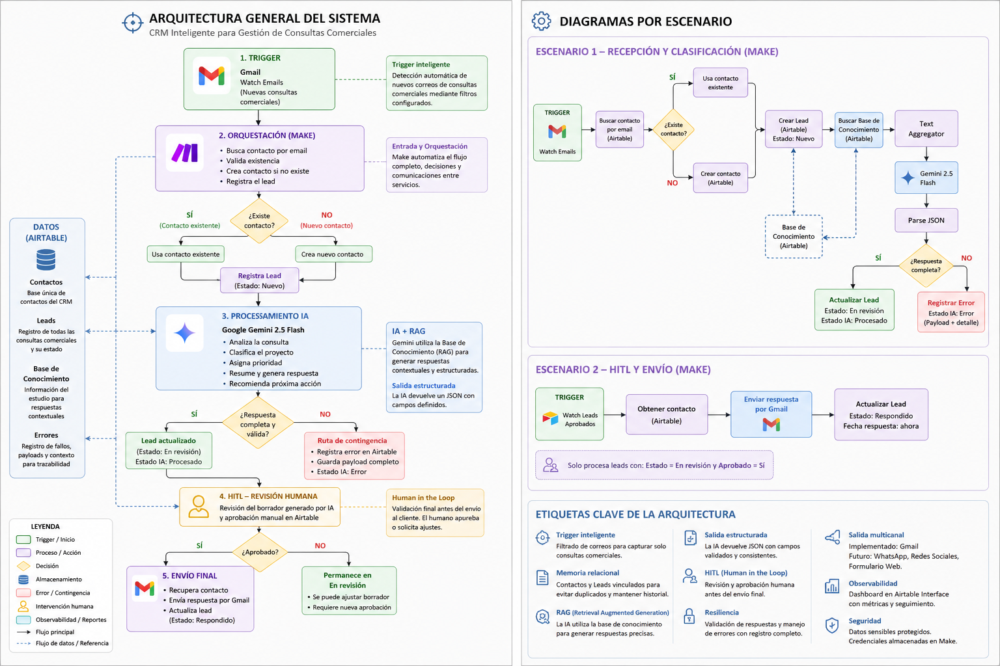
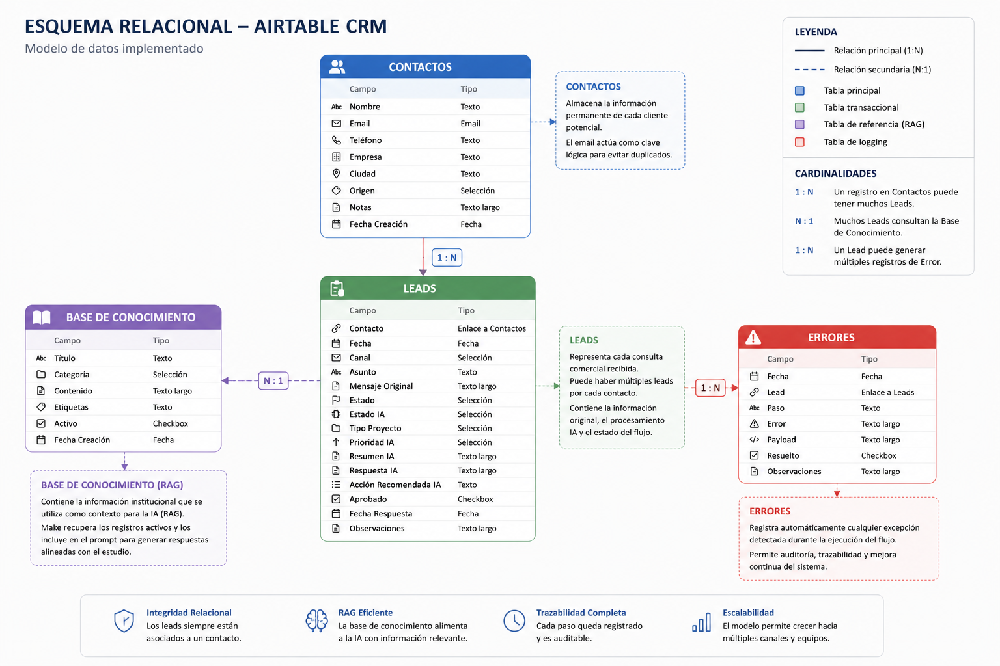

# AI CRM Automation for Architecture Studios

AI-powered automation ecosystem for managing commercial inquiries using
Make, Airtable, Google Gemini and Gmail.

The solution implements Retrieval Augmented Generation (RAG),
Human in the Loop (HITL), structured JSON validation,
automatic error logging and an executive dashboard.

## System Architecture

## Relational Data Model

## Technologies

- Make
- Airtable
- Google Gemini 2.5 Flash
- Gmail
- Airtable Interface

## Main Features

- Automated Gmail inquiry intake
- Contact creation and reuse
- Lead management
- Retrieval Augmented Generation (RAG)
- AI-generated structured responses
- Human approval before email delivery
- Automatic error logging
- Executive dashboard

## Automation Scenarios

### Scenario 1 — Lead Reception and AI Processing

Receives incoming Gmail messages, identifies or creates the contact,
registers the lead, retrieves the knowledge base, invokes Gemini,
validates the JSON response and updates Airtable.

### Scenario 2 — Human Approval and Email Delivery

Detects approved leads, retrieves the associated contact,
sends the reviewed response through Gmail and updates the lead status.

## Repository Structure

- `docs/`: complete project documentation
- `diagrams/`: system architecture and relational model
- `screenshots/`: implementation evidence
- `exports/`: Make scenario blueprints in JSON format

## Documentation

[Download the complete project manual](docs/Manual_Proyecto.pdf)

## Demo Video

[Watch the end-to-end demonstration](https://youtu.be/k_xxB9ZM_jo)

## Security Notice

The Make blueprints are included for academic review.
No API keys or access tokens are stored in this repository.
